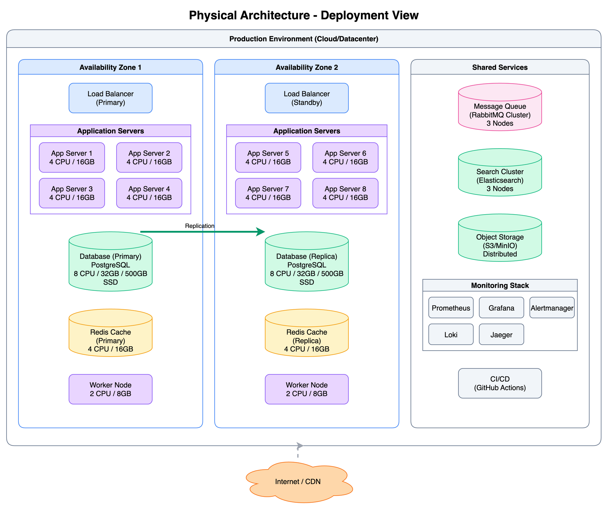

# Architecture Documentation

This directory contains architecture diagrams for [PROJECT_NAME].

## Diagram Index

### High-Level Architecture

#### Logical Architecture


*Three-tier architecture overview showing the API, Business, and Data tiers. ([source](./logical-architecture.drawio))*

#### Physical Architecture


*Deployment view showing environment layout and component placement. ([source](./physical-architecture.drawio))*

### Layer Details
| Layer | Description | Documentation |
|-------|-------------|---------------|
| [API Tier](./layers/api-tier.png) | Gateway and API layer | [Details](./layers/api-tier.md) |
| [Business Tier](./layers/business-tier.png) | Business logic layer | [Details](./layers/business-tier.md) |
| [Data Tier](./layers/data-tier.png) | Data storage layer | [Details](./layers/data-tier.md) |

### Data Flows
| Flow | Description | Documentation |
|------|-------------|---------------|
| [Create Flow](./diagrams/create-flow.png) | Write path through all tiers | [Details](./diagrams/create-flow.md) |
| [Read Flow](./diagrams/read-flow.png) | Read path with caching | [Details](./diagrams/read-flow.md) |

### Infrastructure
| Deployment | Description | Documentation |
|------------|-------------|---------------|
| [Single Environment](./infrastructure/single-environment.png) | Minimum viable deployment | [Details](./infrastructure/single-environment.md) |
| [Multi-Environment](./infrastructure/multi-environment.png) | High availability deployment | [Details](./infrastructure/multi-environment.md) |

---

## Color Scheme

All diagrams follow a consistent color scheme for visual clarity.

### Tier Colors

| Tier | Background | Border | Usage |
|------|------------|--------|-------|
| **API/Gateway** | `#dbeafe` | `#3b82f6` | Gateway, API, and entry point components |
| **Business Logic** | `#e9d5ff` | `#8b5cf6` | Business logic and application services |
| **Data/Storage** | `#d1fae5` | `#10b981` | Databases, caches, and storage components |
| **Services/Support** | `#f1f5f9` | `#64748b` | Supporting services, monitoring, logging |
| **Queue/Messaging** | `#fce7f3` | `#ec4899` | Message queues and event systems |
| **Cache** | `#fef3c7` | `#f59e0b` | Caching layers |
| **External** | `#fed7aa` | `#f97316` | External systems and third-party services |

### Technology-Specific Colors

| Technology | Color | Hex |
|------------|-------|-----|
| PostgreSQL | Blue | `#336791` |
| MySQL | Orange | `#f29111` |
| MongoDB | Green | `#00ed64` |
| Redis | Red | `#dc382d` |
| Elasticsearch | Yellow | `#fed10a` |
| Apache Kafka | Black | `#231f20` |
| RabbitMQ | Orange | `#ff6600` |
| Nginx | Green | `#059669` |
| HAProxy | Indigo | `#6366f1` |
| Node.js | Green | `#68a063` |
| Python | Blue | `#3776ab` |
| Rust | Orange | `#f97316` |
| Go | Cyan | `#00add8` |
| Java | Orange | `#f89820` |
| .NET | Purple | `#512bd4` |
| Docker | Blue | `#2496ed` |
| Kubernetes | Blue | `#326ce5` |

### Environment Colors

| Environment | Color | Hex |
|-------------|-------|-----|
| Production | Green | `#059669` |
| Staging | Blue | `#3b82f6` |
| Development | Orange | `#f97316` |
| Disaster Recovery | Red | `#dc2626` |

### Connection Types

| Type | Style | Color | Usage |
|------|-------|-------|-------|
| Synchronous data flow | Solid arrow, 2px | `#374151` | Direct API calls, sync operations |
| Asynchronous data flow | Solid arrow, 2px | `#8b5cf6` | Queue-based, event-driven |
| Control flow | Dashed arrow, 1px | `#6b7280` | Configuration, health checks |
| Replication | Thick arrow, 3px | `#059669` | Database replication, sync |
| External | Dotted, 1px | `#9ca3af` | Internet, third-party APIs |
| Bidirectional | Both arrows | `#374151` | Two-way communication |

---

## Three-Tier Architecture Overview

```
+---------------------------------------------------------------+
|                         API TIER                                |
|  Handles client requests, authentication, and routing           |
|                                                                 |
|  +-------------+  +-----------+  +-------------+  +-----------+ |
|  | Load        |  | API       |  | Auth        |  | Rate      | |
|  | Balancer    |  | Gateway   |  | Service     |  | Limiter   | |
|  +-------------+  +-----------+  +-------------+  +-----------+ |
+---------------------------------------------------------------+
                              |
                              v
+---------------------------------------------------------------+
|                      BUSINESS TIER                              |
|  Implements business logic, processing, and orchestration       |
|                                                                 |
|  +-------------+  +-----------+  +-------------+  +-----------+ |
|  | Service A   |  | Service B |  | Service C   |  | Worker    | |
|  | [Tech]      |  | [Tech]    |  | [Tech]      |  | [Tech]    | |
|  +-------------+  +-----------+  +-------------+  +-----------+ |
+---------------------------------------------------------------+
                              |
                              v
+---------------------------------------------------------------+
|                        DATA TIER                                |
|  Persistent storage, caching, and data management               |
|                                                                 |
|  +------------------+  +----------------+  +------------------+ |
|  | Primary Database |  | Cache          |  | Search Index     | |
|  | (PostgreSQL)     |  | (Redis)        |  | (Elasticsearch)  | |
|  +------------------+  +----------------+  +------------------+ |
+---------------------------------------------------------------+
```

---

## Editing Guidelines

### Opening .drawio Files

1. **Online**: [app.diagrams.net](https://app.diagrams.net)
   - File -> Open From -> Device

2. **VS Code**: Install [Draw.io Integration](https://marketplace.visualstudio.com/items?itemName=hediet.vscode-drawio)
   - Opens .drawio files directly in VS Code

3. **Desktop**: Download from [diagrams.net](https://www.diagrams.net/)

### Exporting to PNG

```bash
# Export single file (macOS)
/Applications/draw.io.app/Contents/MacOS/draw.io -x -f png -o output.png input.drawio

# Export all diagrams in this directory
for f in $(find . -name "*.drawio"); do
  /Applications/draw.io.app/Contents/MacOS/draw.io -x -f png -o "${f%.drawio}.png" "$f"
done
```

### Update Process

1. Edit the `.drawio` source file
2. Export updated PNG image (or push to trigger GitHub Actions)
3. Update any markdown references if needed
4. Commit both `.drawio` and `.png` files together

---

## Naming Conventions

### File Names

- Use lowercase with hyphens: `api-tier.drawio`, `create-flow.drawio`
- Be descriptive but concise
- Match the markdown file name: `api-tier.drawio` -> `api-tier.md`

### Component Names

- Use clear, descriptive names in diagrams
- Include technology in parentheses when helpful: `Database (PostgreSQL)`
- Use consistent terminology across all diagrams

### Categories

| Category | Directory | Pattern | Examples |
|----------|-----------|---------|----------|
| High-Level | `architecture/` | `{scope}-architecture` | `logical-architecture`, `physical-architecture` |
| Layers | `layers/` | `{tier-name}` | `api-tier`, `business-tier`, `data-tier` |
| Flows | `diagrams/` | `{operation}-flow` | `create-flow`, `read-flow`, `auth-flow` |
| Infrastructure | `infrastructure/` | `{environment-type}` | `single-environment`, `multi-environment` |
