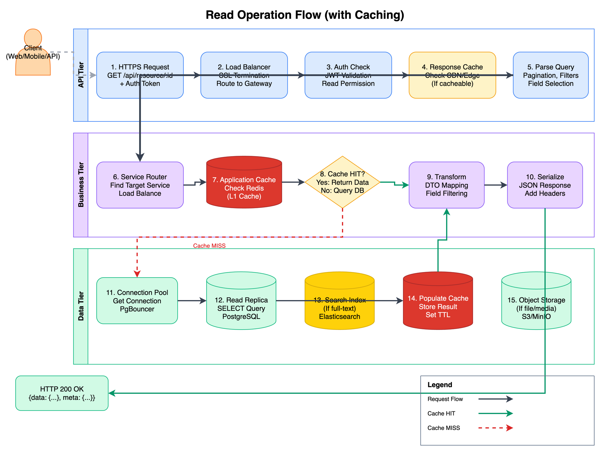

# Read Operation Flow



[View source: read-flow.drawio](./read-flow.drawio)

## Overview

The Read flow describes how data is retrieved from the system, emphasizing the multi-level caching strategy. This flow involves all three tiers with cache checks at multiple levels to minimize database load and latency.

## Flow Steps

### API Tier

#### 1. HTTPS Request

| Attribute | Value |
|-----------|-------|
| Component | Load Balancer / API Gateway |
| Action | Receive incoming GET request |
| Input | GET /api/resource/:id |
| Output | Parsed request with auth token |

#### 2. Load Balancer

| Attribute | Value |
|-----------|-------|
| Component | HAProxy / Nginx |
| Action | SSL termination, route to gateway |
| Input | HTTPS request |
| Output | HTTP request to backend |

#### 3. Auth Check

| Attribute | Value |
|-----------|-------|
| Component | Auth Service |
| Action | Validate JWT token, check read permission |
| Input | Authorization header |
| Output | User context |

#### 4. Response Cache (CDN/Edge)

| Attribute | Value |
|-----------|-------|
| Component | CDN / Edge Cache |
| Action | Check if response is cached at edge |
| Input | Request URL + headers |
| Output | Cached response or cache miss |

#### 5. Parse Query

| Attribute | Value |
|-----------|-------|
| Component | API Gateway |
| Action | Parse pagination, filters, field selection |
| Input | Query parameters |
| Output | Structured query options |

### Business Tier

#### 6. Service Router

| Attribute | Value |
|-----------|-------|
| Component | Service Discovery |
| Action | Find target service, load balance |
| Input | Request path |
| Output | Target service instance |

#### 7. Application Cache (L1)

| Attribute | Value |
|-----------|-------|
| Component | Redis Cache |
| Action | Check application-level cache |
| Input | Cache key (based on query) |
| Output | Cached data or cache miss |

#### 8. Cache Decision

| Attribute | Value |
|-----------|-------|
| Component | Service Logic |
| Action | Determine cache hit or miss |
| Input | Cache lookup result |
| Output | Route to transform or database |

#### 9. Transform

| Attribute | Value |
|-----------|-------|
| Component | DTO Mapper |
| Action | Transform data to response format |
| Input | Domain data |
| Output | Response DTO |

#### 10. Serialize

| Attribute | Value |
|-----------|-------|
| Component | JSON Serializer |
| Action | Create JSON response, add headers |
| Input | Response DTO |
| Output | HTTP response body |

### Data Tier (Cache Miss Path)

#### 11. Connection Pool

| Attribute | Value |
|-----------|-------|
| Component | PgBouncer |
| Action | Acquire database connection |
| Input | Connection request |
| Output | Database connection |

#### 12. Read Replica

| Attribute | Value |
|-----------|-------|
| Component | PostgreSQL Replica |
| Action | Execute SELECT query |
| Input | SQL with parameters |
| Output | Query results |

#### 13. Search Index (Optional)

| Attribute | Value |
|-----------|-------|
| Component | Elasticsearch |
| Action | Full-text search if needed |
| Input | Search query |
| Output | Search results |

#### 14. Populate Cache

| Attribute | Value |
|-----------|-------|
| Component | Redis |
| Action | Store result in cache with TTL |
| Input | Query result |
| Output | Cached entry |

#### 15. Object Storage (Optional)

| Attribute | Value |
|-----------|-------|
| Component | S3 / MinIO |
| Action | Retrieve file/media if needed |
| Input | Object key |
| Output | Presigned URL or binary |

## Request/Response Format

### Request

```http
GET /api/resources/12345?fields=id,name,metadata HTTP/1.1
Host: api.example.com
Authorization: Bearer <jwt-token>
Accept: application/json
```

### Response (Cache Hit)

```http
HTTP/1.1 200 OK
Content-Type: application/json
X-Cache: HIT
Cache-Control: max-age=300

{
  "data": {
    "id": "12345",
    "name": "Example Resource",
    "metadata": {...}
  },
  "meta": {
    "cached": true,
    "cache_ttl": 300
  }
}
```

### Response (Cache Miss)

```http
HTTP/1.1 200 OK
Content-Type: application/json
X-Cache: MISS
Cache-Control: max-age=300

{
  "data": {
    "id": "12345",
    "name": "Example Resource",
    "metadata": {...}
  },
  "meta": {
    "cached": false,
    "db_query_ms": 15
  }
}
```

## Caching Strategy

### Cache Levels

| Level | Location | TTL | Purpose |
|-------|----------|-----|---------|
| L0 | CDN / Edge | 5 min | Static/public content |
| L1 | Redis (App) | 5 min | Frequently accessed data |
| L2 | Query Cache | 1 min | Repeated queries |

### Cache Keys

```
resource:{id}                    # Single resource
resource:list:{hash(filters)}    # Filtered list
resource:search:{hash(query)}    # Search results
```

### Cache Invalidation

- **Write-through**: Invalidate on write operations
- **TTL-based**: Automatic expiration
- **Event-driven**: Invalidate on domain events

## Error Handling

| Scenario | Behavior | Response Code |
|----------|----------|---------------|
| Resource not found | Return not found | 404 |
| Permission denied | Return forbidden | 403 |
| Cache unavailable | Fallback to database | 200 (degraded) |
| Database unavailable | Return stale cache or error | 503 |

## Performance Characteristics

- **Cache Hit Latency**: ~5-10ms
- **Cache Miss Latency**: ~50-100ms
- **Target Cache Hit Rate**: > 90%
- **Throughput**: ~5000 reads/second per instance

## Sequence Diagram

```
Client    CDN     Gateway    Cache    Service    DB
  |        |         |         |         |        |
  |--Req-->|         |         |         |        |
  |        |--Check->|         |         |        |
  |        |  MISS   |         |         |        |
  |        |-------->|--Check->|         |        |
  |        |         |   HIT   |         |        |
  |        |         |<--Data--|         |        |
  |        |<--Resp--|         |         |        |
  |<--200--|         |         |         |        |
```

## Related Diagrams

- [Logical Architecture](../logical-architecture.png) - Overall system view
- [API Tier](../layers/api-tier.md) - Entry point details
- [Data Tier](../layers/data-tier.md) - Storage and caching
- [Create Flow](./create-flow.png) - Write operation path
