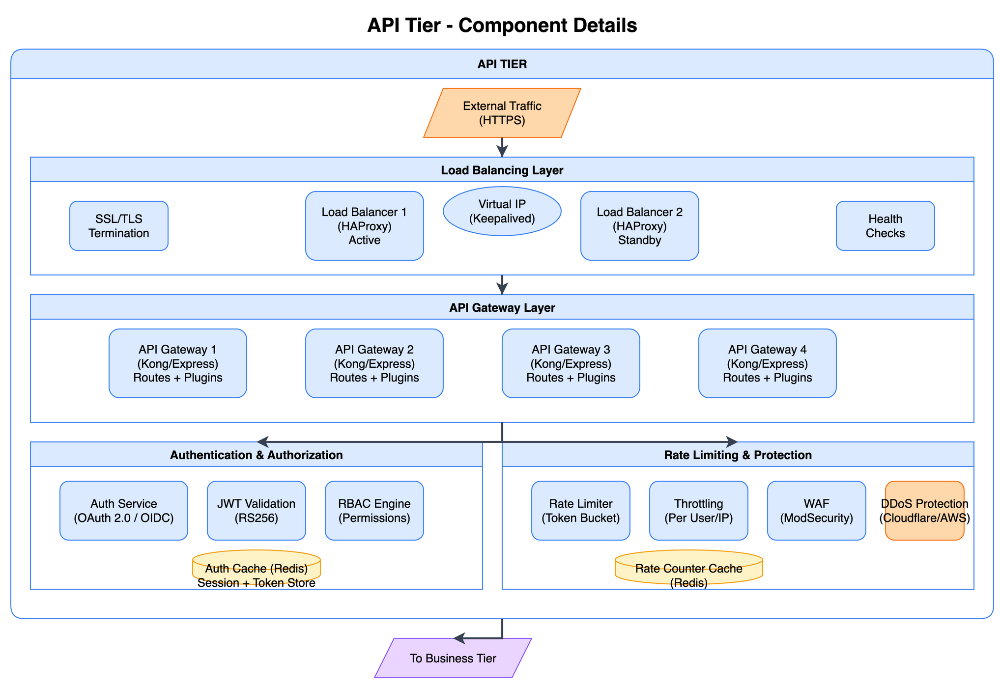

# API Tier



[View source: api-tier.drawio](./api-tier.drawio)

## Overview

The API Tier is the entry point for all client requests. It handles SSL termination, load balancing, authentication, authorization, rate limiting, and routes requests to the appropriate backend services in the Business Tier.

## Components

### Load Balancer (HAProxy)

High-availability load balancing with automatic failover.

| Attribute | Value |
|-----------|-------|
| Technology | HAProxy 2.x with Keepalived |
| Purpose | SSL termination, request distribution, health checking |
| Scales | Horizontal (Active-Passive pair per AZ) |

**Features:**
- SSL/TLS termination (TLS 1.2/1.3)
- Health checking of backend services
- Round-robin and least-connections algorithms
- Connection pooling and request queuing
- Automatic failover via VRRP (Keepalived)

### API Gateway (Kong/Express)

Request routing, transformation, and plugin execution.

| Attribute | Value |
|-----------|-------|
| Technology | Kong Gateway or Express.js |
| Purpose | Route requests, apply middleware, transform payloads |
| Scales | Horizontal (4+ instances recommended) |

**Features:**
- Path-based routing to backend services
- Request/response transformation
- Plugin system (logging, tracing, caching)
- OpenAPI/Swagger documentation serving
- Request validation

### Authentication Service

OAuth 2.0 / OpenID Connect compliant authentication.

| Attribute | Value |
|-----------|-------|
| Technology | Keycloak, Auth0, or custom OAuth server |
| Purpose | User authentication, token issuance |
| Scales | Horizontal with shared session store |

**Features:**
- OAuth 2.0 authorization code flow
- JWT token issuance (RS256)
- Refresh token rotation
- Multi-factor authentication support
- Social login integration

### JWT Validation

Token validation middleware for protected endpoints.

| Attribute | Value |
|-----------|-------|
| Technology | JWT libraries (jose, jsonwebtoken) |
| Purpose | Validate access tokens on every request |
| Scales | Stateless (runs in gateway) |

**Features:**
- RS256 signature verification
- Token expiration checking
- Claims validation (iss, aud, scope)
- Public key caching

### RBAC Engine

Role-based access control for authorization decisions.

| Attribute | Value |
|-----------|-------|
| Technology | Custom RBAC or Casbin |
| Purpose | Permission checking based on roles |
| Scales | Stateless with cached policies |

**Features:**
- Role hierarchy support
- Resource-level permissions
- Dynamic policy updates
- Audit logging

### Rate Limiter

Request rate limiting to prevent abuse.

| Attribute | Value |
|-----------|-------|
| Technology | Redis-based token bucket |
| Purpose | Protect services from overload and abuse |
| Scales | Distributed via Redis |

**Features:**
- Per-user rate limits
- Per-IP rate limits
- Per-endpoint limits
- Sliding window algorithm
- Rate limit headers (X-RateLimit-*)

### Auth Cache (Redis)

Caching layer for authentication data.

| Attribute | Value |
|-----------|-------|
| Technology | Redis 6.x |
| Purpose | Cache tokens, sessions, and user data |
| Scales | Redis Cluster or Sentinel |

**Features:**
- Session storage
- Token blacklist
- User permission cache
- TTL-based invalidation

## Request Flow

```
1. External Request (HTTPS)
       |
2. DDoS Protection (Cloudflare/AWS Shield)
       |
3. Load Balancer (SSL Termination)
       |
4. API Gateway (Routing + Plugins)
       |
5. Authentication Check (JWT Validation)
       |
6. Authorization Check (RBAC)
       |
7. Rate Limit Check
       |
8. Forward to Business Tier
```

## Scaling

- **Load Balancers**: Deploy active-passive pairs per availability zone
- **API Gateways**: Add instances behind load balancer; 4+ for production
- **Auth Service**: Horizontal scaling with shared Redis session store
- **Redis Cache**: Use Redis Cluster for high throughput

## Configuration

### Load Balancer Configuration

| Parameter | Description | Recommended |
|-----------|-------------|-------------|
| `maxconn` | Maximum concurrent connections | 50000 |
| `timeout connect` | Backend connection timeout | 5s |
| `timeout server` | Backend response timeout | 30s |
| `health check interval` | Health check frequency | 2s |

### Rate Limiting Configuration

| Parameter | Description | Recommended |
|-----------|-------------|-------------|
| `requests_per_second` | Default rate limit | 100/user |
| `burst_size` | Burst allowance | 20 |
| `window_size` | Sliding window duration | 1 minute |

## Monitoring

Key metrics to monitor for this tier:

| Metric | Description | Alert Threshold |
|--------|-------------|-----------------|
| Request latency (p99) | 99th percentile response time | > 500ms |
| Error rate | 5xx responses / total | > 1% |
| Connection queue depth | Waiting connections | > 100 |
| Auth cache hit rate | Cache hits / total lookups | < 80% |
| Rate limit rejections | Rejected requests / total | Spike detection |

## Related Diagrams

- [Logical Architecture](../logical-architecture.png) - Overall system view
- [Create Flow](../diagrams/create-flow.png) - How requests flow through this tier
- [Read Flow](../diagrams/read-flow.png) - Read path with caching
