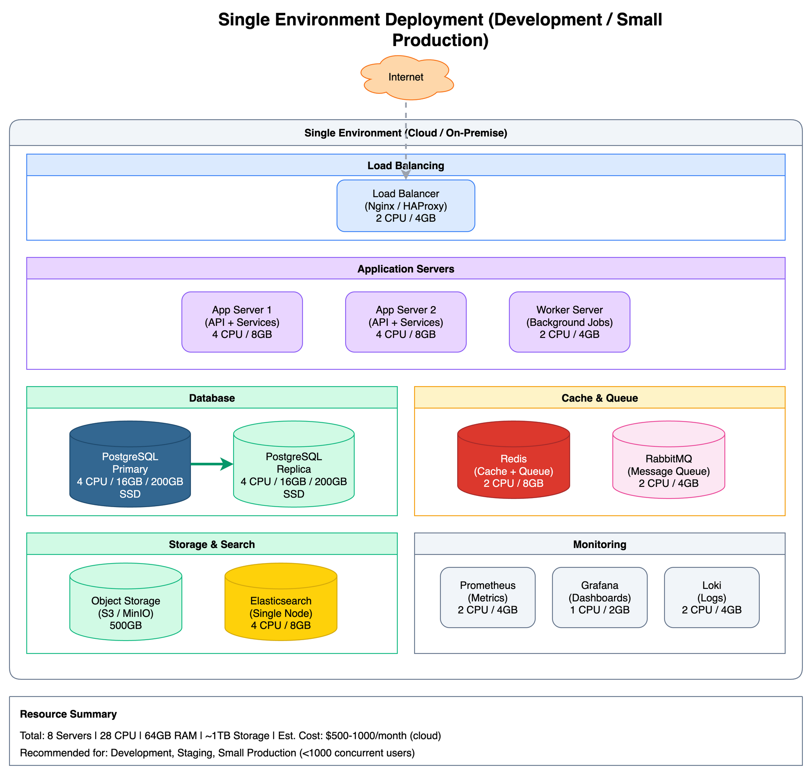

# Single Environment Deployment



[View source: single-environment.drawio](./single-environment.drawio)

## Overview

The Single Environment deployment is a minimal but production-capable configuration suitable for development, staging, or small production workloads. It provides basic high availability for the database while keeping costs and complexity low.

## Architecture Layout

### Load Balancing

| Component | Count | Specifications | Purpose |
|-----------|-------|----------------|---------|
| Load Balancer | 1 | 2 CPU / 4GB | SSL termination, request routing |

### Application Servers

| Component | Count | Specifications | Purpose |
|-----------|-------|----------------|---------|
| App Server | 2 | 4 CPU / 8GB each | API + Business services |
| Worker Server | 1 | 2 CPU / 4GB | Background job processing |

### Database

| Component | Count | Specifications | Purpose |
|-----------|-------|----------------|---------|
| PostgreSQL Primary | 1 | 4 CPU / 16GB / 200GB SSD | Read + Write operations |
| PostgreSQL Replica | 1 | 4 CPU / 16GB / 200GB SSD | Read operations, failover |

### Cache & Queue

| Component | Count | Specifications | Purpose |
|-----------|-------|----------------|---------|
| Redis | 1 | 2 CPU / 8GB | Application cache, session store |
| RabbitMQ | 1 | 2 CPU / 4GB | Message queue |

### Storage & Search

| Component | Count | Specifications | Purpose |
|-----------|-------|----------------|---------|
| Object Storage | 1 | 500GB | File and media storage |
| Elasticsearch | 1 | 4 CPU / 8GB | Full-text search |

### Monitoring

| Component | Count | Specifications | Purpose |
|-----------|-------|----------------|---------|
| Prometheus | 1 | 2 CPU / 4GB | Metrics collection |
| Grafana | 1 | 1 CPU / 2GB | Dashboards |
| Loki | 1 | 2 CPU / 4GB | Log aggregation |

## Resource Requirements

### Total Resources

| Resource | Amount |
|----------|--------|
| Servers | 8 |
| Total CPUs | 28 cores |
| Total Memory | 64 GB |
| Total Storage | ~1 TB |

### Estimated Cost

| Environment | Monthly Cost |
|-------------|--------------|
| Cloud (AWS/GCP/Azure) | $500 - $1000 |
| On-premise | Hardware + maintenance |

## High Availability

### Database HA

- Streaming replication from primary to replica
- Manual failover (or automated with Patroni)
- RPO: Near-zero (synchronous replication possible)
- RTO: 5-10 minutes (manual) / < 1 minute (automated)

### Application HA

- 2 application servers behind load balancer
- Rolling deployments supported
- No single point of failure for application tier

### Limitations

| Component | HA Status |
|-----------|-----------|
| Load Balancer | Single point of failure |
| Redis | Single instance (no replication) |
| Elasticsearch | Single node (no redundancy) |
| RabbitMQ | Single instance |

## Limitations

| Limitation | Impact | Mitigation |
|------------|--------|------------|
| Single load balancer | Potential downtime | Add DNS failover or floating IP |
| Single Redis instance | Cache unavailable on failure | Application fallback to database |
| Single Elasticsearch | Search unavailable on failure | Graceful degradation |
| Limited scale | Max ~1000 concurrent users | Upgrade to multi-environment |

## Recommended Use Cases

This deployment is recommended for:
- Development environments
- Staging environments
- Small production deployments (< 1000 concurrent users)
- Proof of concept deployments
- Cost-sensitive deployments

This deployment is NOT recommended for:
- High-availability requirements (99.9%+ SLA)
- High traffic applications (> 1000 concurrent users)
- Mission-critical systems

## Scaling Path

### Vertical Scaling

1. Increase database server resources (CPU/Memory)
2. Add more storage to existing servers
3. Upgrade Redis to larger instance

**Limits**: Single instance bottlenecks around 16 CPU / 64GB

### Horizontal Scaling

1. Add more application server instances
2. Add read replicas for database
3. Scale to multi-environment deployment

## Migration Path

### To Multi-Environment Deployment

When this deployment is no longer sufficient:

1. **Provision additional infrastructure** in second availability zone
2. **Set up database replication** to new zone
3. **Configure load balancer** for cross-zone distribution
4. **Add Redis Sentinel** for cache failover
5. **Migrate Elasticsearch** to cluster mode
6. **Update DNS** for multi-zone routing

**Estimated Downtime**: 15-30 minutes with proper planning

## Network Topology

```
         Internet
             |
       [Load Balancer]
          /     \
    [App 1]   [App 2]   [Worker]
          \     /          |
           [Redis]    [RabbitMQ]
               \        /
            [PostgreSQL]
             (Primary)
                 |
            [PostgreSQL]
             (Replica)
```

## Configuration Examples

### Load Balancer (Nginx)

```nginx
upstream api {
    server app1:3000 weight=1;
    server app2:3000 weight=1;
}

server {
    listen 443 ssl;

    location /api {
        proxy_pass http://api;
    }
}
```

### Database Connection

```yaml
database:
  primary:
    host: db-primary
    port: 5432
    pool_size: 20
  replica:
    host: db-replica
    port: 5432
    pool_size: 30
```

## Related Diagrams

- [Logical Architecture](../logical-architecture.png) - Component relationships
- [Multi-Environment](./multi-environment.png) - High availability deployment
- [Physical Architecture](../physical-architecture.png) - Full deployment view
